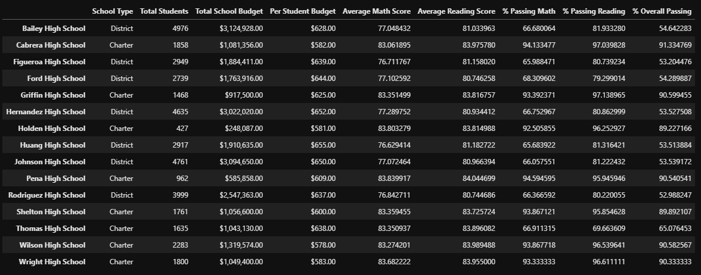
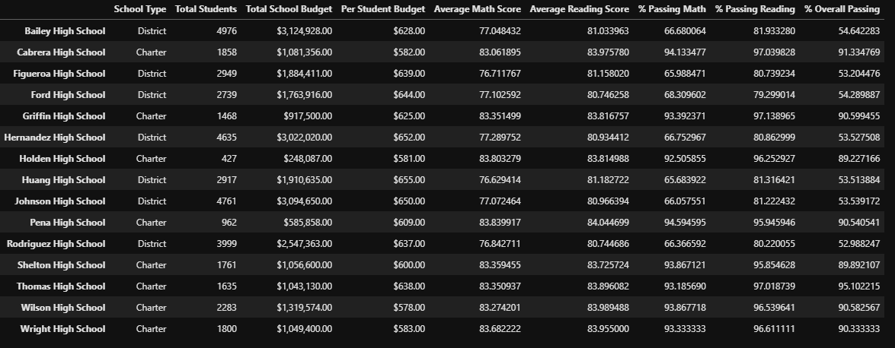
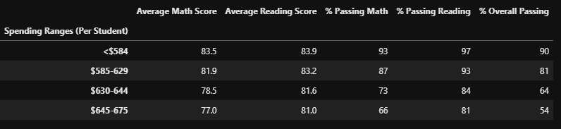
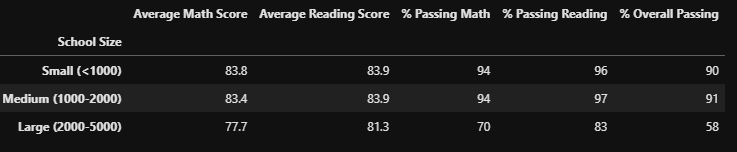
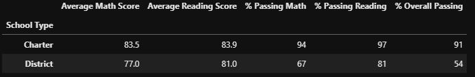

# School_District_Analysis
## Overview
The school board for a certain school district has notified Maria and her supervisor that there is evidence of academic dishonesty in a .csv file named students_complete.csv. This file provides the school board with the student's ID number, name, gender, grade, school name, score in reading and their score in math. The evidence points to the scores being altered in Math and Reading for 9th grade students at Thomas High School. The school board is unaware of the extent of the academic dishonesty, so they have reached out to Maria, the chief data scientist for the school district for help. She is responsible for analyzing information from a variety of sources and in a variety of formats. Maria has reached out for assistance in determining the extent of the academic dishonesty as well as analyzing data on student funding and students standardized test scores. Maria needs help agrigating the students data and showcase trends in schools perfomance. This infomration will be given directily to the school board and superintendent to help make decisions about the schools budget and priorities. 

## Results
-How is the district summary affected? 

      The district summary is affected by the academic dishonesty from the 9th grade students at Thomas High School 
      because the data shows the average scores and percent of those who passed both math and reading for the entire 
      district before the values of the 9th graders from Thomas High School are changed to NaN. 

-How is the school summary affected?
   
      The school summary is also affected the same way as the district summary above. The calculations were done
      before the dishonest values were removed. 

-How does replacing the ninth graders’ math and reading scores affect Thomas High School’s performance relative to the other schools?

   The image below shows the Per_School_Summary_df before the updated percentage passing values for Thomas High School were added into the dataframe.    
   
      
   The image below shows the Per_School_Summary_df after the updated percentage passing values for Thomas High School were added into the dataframe.    
   
   
   The percent passing in math, reading, and overall for Thomas High School drastically improved with the exclussion of 9th grade scores and percetages. The previous percentages(in the first image) were 66.9% passing math, 69.6% passing reading, and 65.1% passing overall. After the removal of the 9th grade scores and percentages, the percentages changed to 93.2% passing math, 97.0% passing reading, and 95.1% passing overall. 

-How does replacing the ninth-grade scores affect the following:

    -Math and reading scores by grade
    Replaceing the 9th grade scores with NaN does not have an affect on the other grades scores for both math and reading. 
    Since they are grouped together by grade, the 9th grade scores have no affect on the other grades scores. 
  
    -Scores by school spending
    Comparing the percent passing of math, reading, and the overall of the 10th-12th grade students (excluding the 9th) from 
    Thomas High School to that of the other schools in the district, Thomas High would likely spend less money per student. The 
    other schools with similar passing rates to the 10th-12th grade students at Thomas High spend less than $584 compared to the 
    $630-644 dollars spent by Thomas High. 
    
    

    -Scores by school size
    The size of Thomas High School's 10th-12th grade student body is 1174 students. Adding the additional 461 9th grade student's 
    scores would have little to no affect on the overall percentages and scores of the distrct for a school this size. Also adding 
    the 9th grade studetns would keep the school in the same size bracket for score comparisons. 
    
    

    -Scores by school type
    
     The majority of the schools in this district are Charter schools. The addition of the scores and passing percentages for the 9th
     grade students at Thomas High School would have little impact on the already existing values. 

## Summary

Replacing the values for the 9th grade students at Thomas High School with NaN essentially makes it so the grades don't exist. They cannot
be calculated with the rest of the students data. This is why the information for the 10-12th grade students needed to be recalculated to get 
accurate numbers for the high school. Because of this, the math and reading scores by grade for the district aren't affected at all. The values
each grade are seperate so the 9th grade values are not affecting the other grades. There are so many school of the same type (charter) and of 
the same size (1000-2000) that the removal of the grades has little affect on the over numbers. The only metric that would change is the money 
spend per student. Comparing the moeny spend by schools with simialr scores to that of the 10th-12th grade at Thomas High indicates that THS would
spend less money per student that they currently are. 
